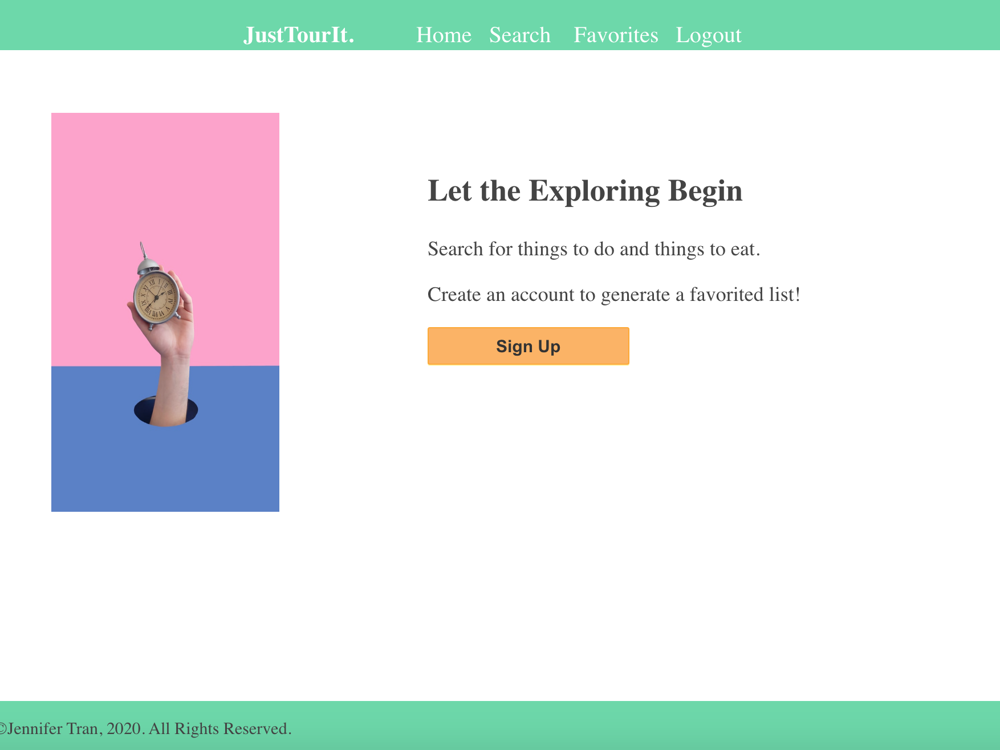
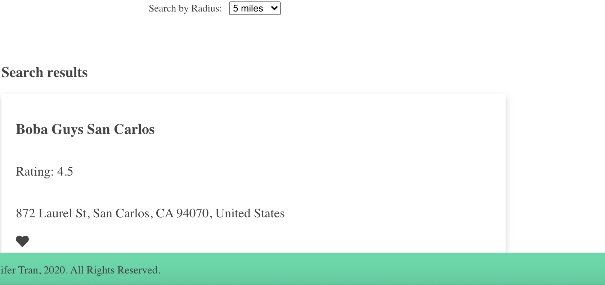

LetsTourIt
========
* * *

Summary
-------

This is an application where users can search up places near their current location. The user can favorite a place so that they can refer to the favorited list later. 

Demo
----
* * *

[Demo](https://letstourit.jennantran.vercel.app)
[Repo](https://github.com/jennantran/letstourit-app)

Demo user account:  
username: jennantran  
password: password
* * *

Getting Started
---------------
To set up the server: https://github.com/jennantran/letstourit-server
1. Clone the client repository to your local machine: git clone https://github.com/jennantran/letstourit-app.git
2. Cd into the new cloned repository
3. Install the node dependencies using npm install

Scripts
-----------
To start the application: npm start
To start nodemon for the application: npm run dev
Run the tests: npm test

Screenshots
-----------
Homepage:

Favorites Page:

Search Page:

Results: 

* * *

Technologies Used
-----------------
1. React
2. CSS
3. Node
4. Express
